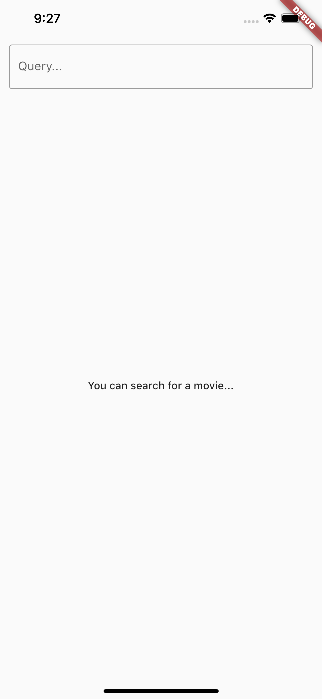
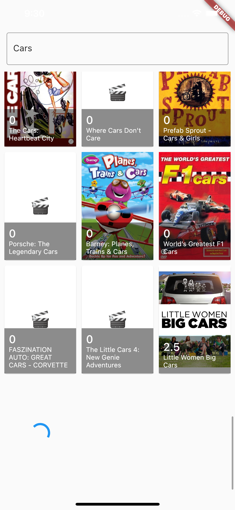

# The Movie App

This project allows you to search and list movies.

## Screen Shots
<p float="left">
  
  
  
  
  
</p>

## Libraries

- flutter_localizations -> used for localization
- flutter_bloc -> used for state managment
- dio -> user for network request
- bloc_concurrency -> used to not send multiple network requests
- async -> used to trigger an action when the user stopped typing

## Getting Started

This is an example of how you may give instructions on setting up your project locally.
To get a local copy up and running follow these simple example steps.

```sh
flutter gen-l10n
flutter run
```
